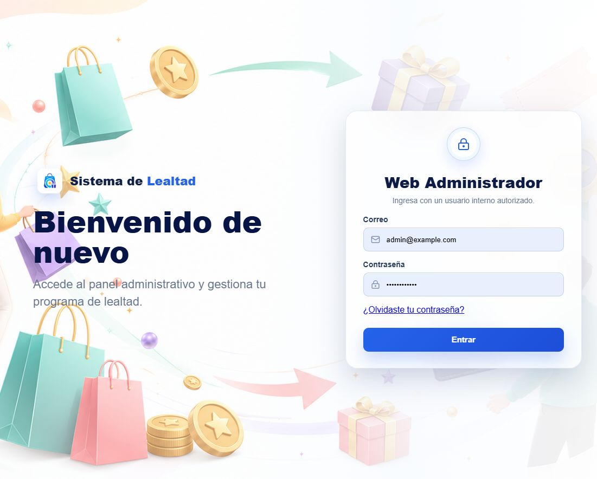
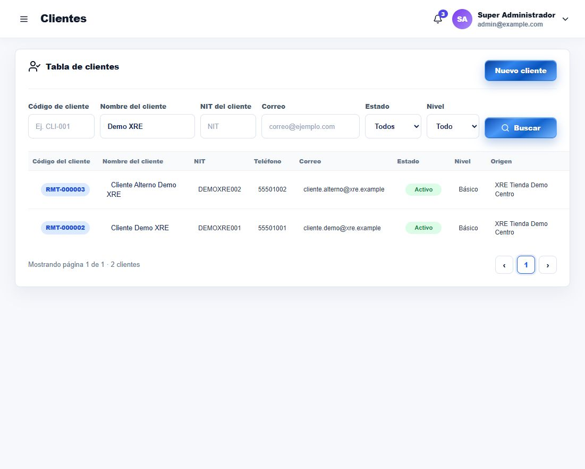
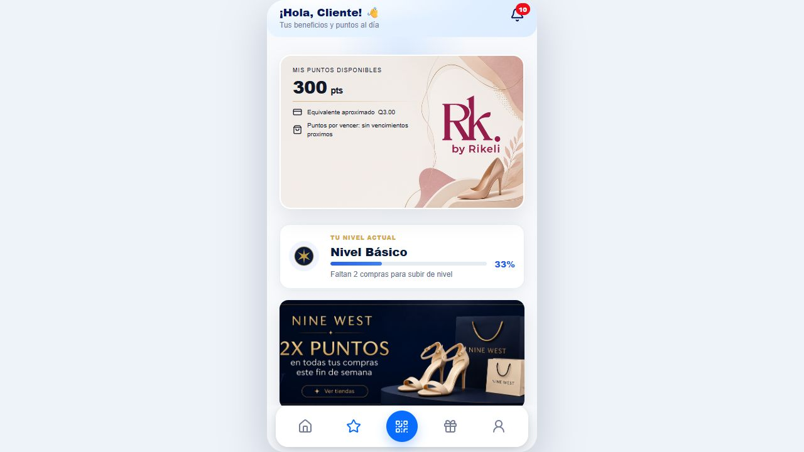
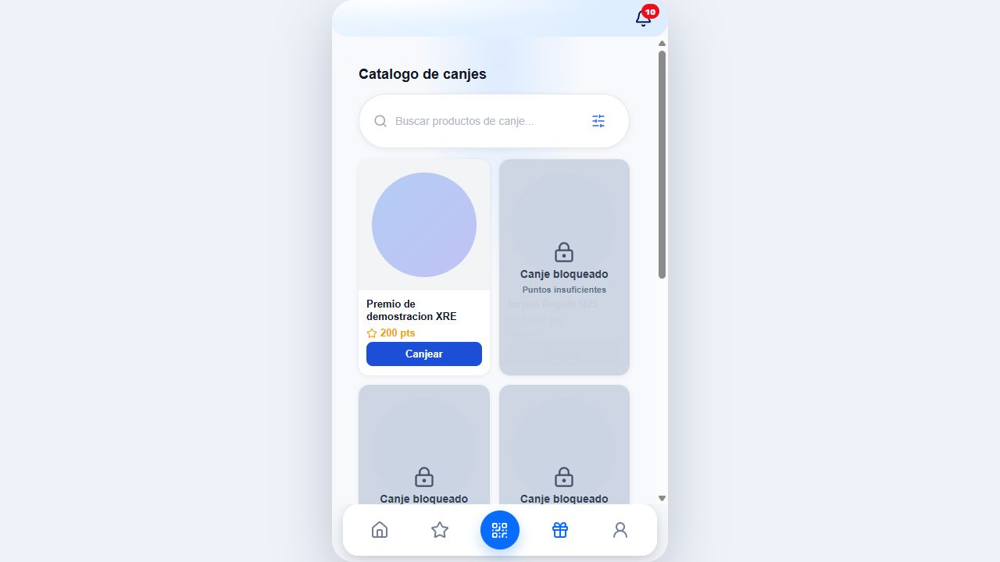
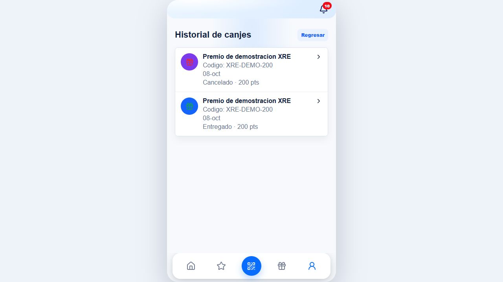
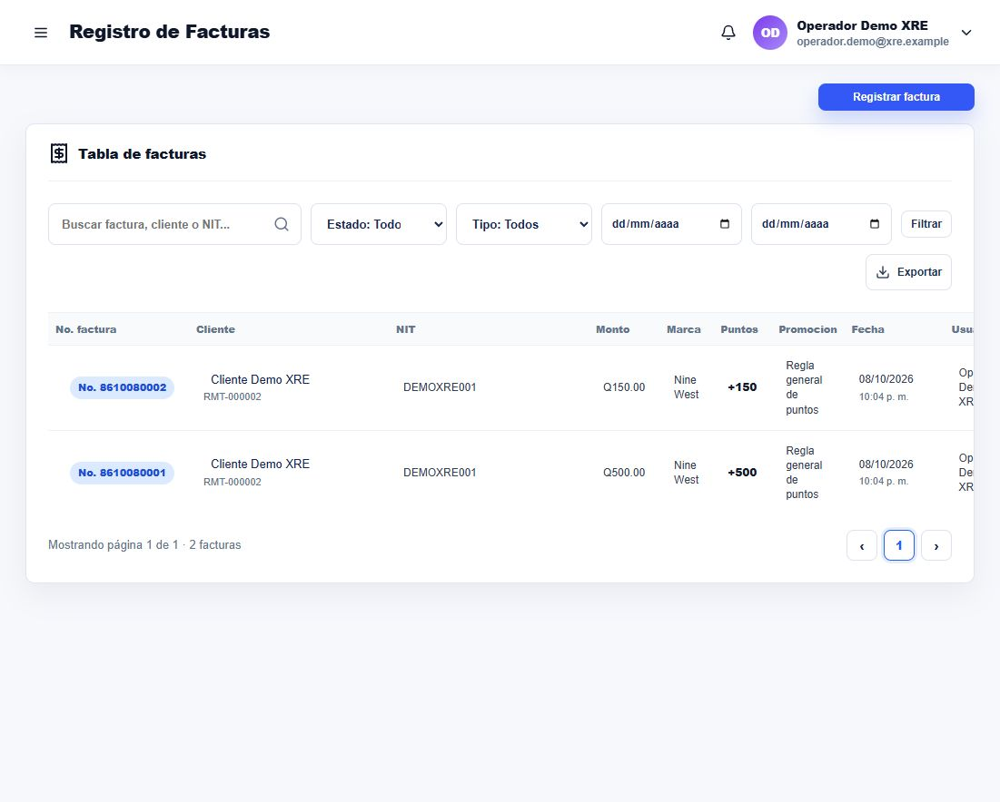
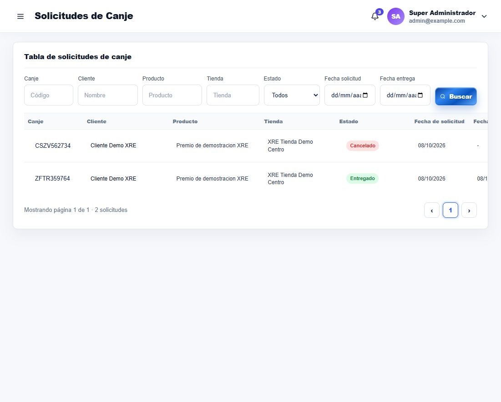
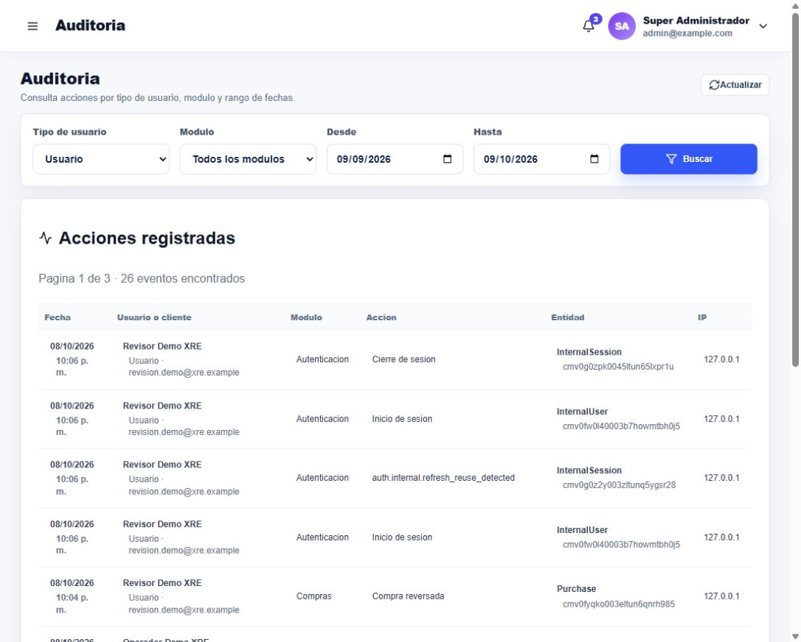

# Manual de usuario del sistema de lealtad de XRE Docs

Acceso, operación de tienda y consulta de beneficios

Este manual explica las funciones principales del programa de lealtad con capturas de la implementación local. Está dirigido a clientes, personal de tienda y administradores. Los controles y pantallas disponibles dependen de los permisos asignados.

Integrantes: Victor Estuardo Florian, Dino Fiagioli, Jorge Otoniel Castillo Ortega. Fecha: 8 de octubre de 2026.

Acceso local: administración en http://localhost:3000, clientes en http://localhost:3002 y repartidores en http://localhost:3003. Docker Desktop y los servicios deben estar iniciados. En un despliegue público se utilizarán las direcciones HTTPS aprobadas por la empresa.

Las cuentas Demo XRE se usan para prácticas. Las credenciales se conservan en un archivo local privado separado del paquete académico. El administrador debe proporcionar el acceso mediante un canal privado. Ninguna captura del manual contiene una contraseña o token de sesión.

Recorrido de consulta: acceso, clientes, puntos, premios, historial, facturas, atención de canjes, permisos y auditoría. Al terminar una sesión compartida se debe utilizar Cerrar sesión.

| Perfil | Funciones principales |

| --- | --- |

| Cliente | Consultar su saldo, solicitar premios y revisar historial |

| Personal de tienda | Registrar facturas y preparar o entregar canjes |

| Revisor | Aprobar solicitudes, revisar compras y consultar auditoría |

| Administrador | Configurar usuarios, accesos, tiendas y reglas |

# Ingreso a la aplicación

Cada portal utiliza la identidad correspondiente

Cliente: abrir http://localhost:3002, ingresar el correo registrado y la contraseña y pulsar Iniciar sesión. Para una cuenta nueva, seleccionar Regístrate aquí, completar nombre, NIT, teléfono, correo y contraseña y elegir la marca y tienda disponibles cuando corresponda.

Usuario interno: abrir http://localhost:3000, ingresar el correo y la contraseña proporcionados y pulsar Entrar. Si aparece el cambio obligatorio de contraseña, el titular debe completarlo antes de operar.

Si el acceso falla, revisar el correo y solicitar asistencia por un canal privado. Los intentos repetidos pueden producir bloqueo temporal o límite de solicitudes. No compartir la contraseña ni copiar las cookies del navegador.

E15. Pantalla real de acceso administrativo sin credenciales visibles.

# Clientes y perfil administrativo

Búsqueda y revisión de un cliente

Abrir Clientes. Utilizar código, nombre, NIT, correo, estado o nivel para filtrar y pulsar Buscar. En la demostración se filtró Demo XRE para evitar mostrar registros de otras personas.

Seleccionar Ver en el cliente deseado. El perfil muestra datos de identificación, nivel, compras y canjes. Revisar su historial antes de registrar una corrección. Las reversas y cancelaciones conservan la referencia de la operación original.

Para una alta administrativa, pulsar Nuevo cliente y completar los datos obligatorios. Elegir país, departamento y municipio en el orden solicitado. Registrar correo y teléfono correctos, ya que el servidor bloquea duplicados. Utilizar datos ficticios identificados como demo durante prácticas.

E04. Lista filtrada con los dos clientes de demostración.

# Puntos y nivel del cliente

Consulta del saldo disponible

Después de iniciar sesión, abrir Puntos lealtad en la navegación inferior. La tarjeta muestra el saldo disponible, su equivalencia aproximada y los vencimientos que pueda proporcionar el sistema.

En la demostración existen 300 puntos después de acumular 500 y entregar un premio de 200. La equivalencia de Q3 utiliza la configuración vigente y no es un retiro de efectivo.

El nivel se calcula con compras válidas. Consultar el último movimiento y usar Perfil para revisar el historial. Si el saldo parece incorrecto, informar el número de factura o de canje al personal autorizado.

E02. Tarjeta de puntos del cliente. Recorte de la captura original para facilitar su lectura.

# Solicitud de un producto canjeable

La disponibilidad depende del saldo y del producto

Abrir Canjes en el menú inferior. Buscar el producto y revisar puntos, disponibilidad y condiciones. El catálogo filtra premios globales y de la marca del cliente.

Pulsar Canjear en un producto habilitado y revisar la confirmación y la tienda de retiro. Confirmar únicamente cuando los datos sean correctos. La solicitud reserva puntos. Si requiere aprobación, consultar su avance en Perfil y luego Historial de canjes.

El sistema bloquea los premios para los que no existen puntos suficientes. En la captura, el premio Demo XRE de 200 puntos está disponible para un saldo de 300. Los premios de mayor costo aparecen bloqueados.

Para cancelar una solicitud pendiente, abrir su detalle y usar la opción de cancelación disponible, con una razón. Los estados y permisos determinan cuándo es posible cancelar. Una solicitud ya entregada no se debe registrar otra vez.

E09. Catálogo real con un premio habilitado y otros bloqueados por saldo insuficiente.

# Historial y cierre de sesión del cliente

Consulta de compras y canjes propios

Abrir Perfil. Seleccionar Historial de compras para comprobar facturas, tienda, fecha y puntos. Una factura anulada aparece con Puntos revertidos. Seleccionar Historial de canjes para revisar el estado de cada solicitud y abrir su detalle.

En la demostración hay un canje Entregado y otro Cancelado del mismo producto. La factura de Q500 conserva sus 500 puntos acreditados y la de Q150 indica la reversa.

Desde Perfil se puede revisar Datos personales y Dirección. El cambio de contraseña lo debe realizar el titular de la cuenta. Al terminar, pulsar Cerrar sesión, especialmente en un equipo compartido.

E12. Historial del cliente con las solicitudes entregada y cancelada.

# Registro de una factura en tienda

La operación requiere una tienda activa asignada

Ingresar con el usuario de tienda. Si aparece el selector, elegir la tienda asignada y confirmar. Si el sistema informa que falta tienda activa, completar esa selección antes de registrar o consultar facturas.

Abrir Registro de Facturas y pulsar Registrar factura. Buscar y seleccionar al cliente, verificar su NIT, ingresar un número de factura nuevo de 6 a 15 dígitos y el monto. Seleccionar el tipo de producto y la marca o categoría cuando aplique.

Revisar la previsualización de puntos antes de confirmar. La tienda deriva de la sesión. No se debe intentar cambiarla mediante datos de la solicitud. El servidor rechaza monto inválido, NIT no coincidente y factura duplicada por tienda.

En la tabla se pueden filtrar estado, tipo y fechas. Las operaciones de reversa requieren autorización y una razón. Las facturas de demostración 8610080001 y 8610080002 ya existen y no se deben volver a usar.

E16. Facturas de la tienda demo vistas por el operador autorizado.

# Atención de un canje por la administración

Estados y responsables de la entrega

Abrir Gestión de Lealtad y luego Solicitudes de Canje. Filtrar por código, cliente, producto, tienda o estado y abrir Ver solicitud.

El revisor autorizado valida cliente, puntos y disponibilidad y utiliza la acción de aprobación. Después registra el envío a tienda. El personal de la tienda asignada marca el producto como listo y registra la entrega, indicando quién recibe y una observación cuando corresponda.

Revisar el detalle para comprobar puntos antes y después, aprobador, responsable de entrega y línea de tiempo. El ejemplo entregado consumió 200 de 500 puntos y dejó 300. El servidor rechazó otra entrega de la misma solicitud.

Una cancelación o rechazo requiere una razón y debe seguir el estado permitido. No modificar saldos directamente para ocultar errores. Usar las acciones compensatorias y conservar la evidencia.

E06. Solicitudes reales de demostración con estados Cancelado y Entregado.

# Usuarios permisos y auditoría

La administración controla quién puede ejecutar cada operación

Abrir Usuarios y seleccionar Ver usuario. Revisar estado, rol, tienda asignada y permisos por módulo. Los permisos directos determinan las operaciones autorizadas por el servidor. Guardar permisos sólo cuando exista autorización para modificar el acceso.

El usuario Operador Demo XRE tiene 7 permisos y una tienda asignada. Su casilla de auditoría está desmarcada. La prueba de API confirmó que ese usuario recibe HTTP 403 al intentar consultar el control de auditoría.

Para revisar acciones, ingresar con una cuenta que tenga audit.read y abrir Auditoría. Seleccionar tipo de usuario, módulo y fechas y pulsar Buscar. Los eventos muestran fecha, actor, acción y entidad. Utilizar filtros para revisar sólo el incidente o proceso correspondiente.

Los logs pueden contener información personal. Limitar su acceso y proteger las exportaciones. Las capturas del entregable muestran acciones de las cuentas demo y no exponen valores de tokens.

E08. Auditoría real con acciones de compra, reversa, aprobación, entrega y sesiones.

# Configuración y módulos complementarios

Catálogos tiendas reglas y comercio online

En Catálogos, revisar Tiendas y los catálogos de marca y geografía. Al crear una tienda, registrar sus datos, estado y ubicación y asignar los usuarios que pueden operarla. Una tienda inactiva o no asignada no se puede seleccionar para operar.

En Parámetros, revisar reglas de puntos y promociones. Una modificación afecta el cálculo de nuevas operaciones. Confirmar vigencia, monto por punto, topes y condiciones antes de activar una regla. Mantener el historial de los cambios.

En Productos Canjeables, revisar puntos, stock, publicación, marca y necesidad de aprobación. Un producto agotado no debe ofrecerse al cliente. Las capturas de solicitudes permiten comprobar el responsable y el stock reservado durante el flujo.

La sección Tienda Online contiene marcas, productos, pedidos, agenda de entregas, mensajeros y liquidación de cobros. El repartidor usa el portal de http://localhost:3003 con su cuenta y entregas asignadas. Las reglas de entrega dependen del medio y estado del pago. Este manual se centra en el proceso de lealtad que se demostró.

Los reportes y métricas deben interpretarse según sus filtros y fuentes. Algunas alertas de vencimientos e inactividad muestran cero mientras falta su endpoint. No usar esos ceros como prueba de ausencia de riesgo o actividad.

| Cambio | Revisión previa |

| --- | --- |

| Regla de puntos | Vigencia, proporción, mínimo y máximo |

| Producto canjeable | Publicación, marca, stock y puntos |

| Tienda | Estado, ubicación y usuarios asignados |

| Usuario | Estado, tienda y permisos directos |

| Reporte | Período, filtros y datos disponibles |

# Problemas frecuentes y uso seguro

Acciones de recuperación sin perder datos

Si la página no carga, comprobar Docker Desktop, la URL y los servicios con docker compose -f docker-compose.yml -f docker-compose.local.yml ps. Abrir /api/health y comprobar que base y almacenamiento respondan. Solicitar diagnóstico de logs al responsable técnico.

Si falta una función, revisar permisos y tienda activa. Un menú oculto o un HTTP 403 requiere que un administrador revise la autorización. No compartir una cuenta de mayor privilegio para continuar una operación.

Si aparece factura duplicada, buscar la referencia existente antes de volver a registrar. Para una corrección, un responsable debe reversar la operación con una razón. Si el canje tiene saldo insuficiente o stock agotado, elegir otro beneficio o esperar una actualización válida.

Si la sesión vence o el token CSRF no coincide, cerrar sesión e ingresar de nuevo. Si aparece un límite de solicitudes, esperar el período indicado. No introducir contraseñas en capturas ni enviar archivos .env al presentar una incidencia.

Si se necesita reiniciar, detener y volver a iniciar con los comandos previstos. No ejecutar down -v para resolver errores: elimina volúmenes. Antes de una modificación de datos importante, solicitar un respaldo verificable. La recuperación debe validarse en una base temporal.

Antes de la exposición: iniciar servicios, abrir la cuenta demo del cliente, comprobar 300 puntos, abrir la lista de facturas y tener preparado el canje entregado y la auditoría. Usar las capturas de la presentación si una recarga supera el tiempo de la demostración.

